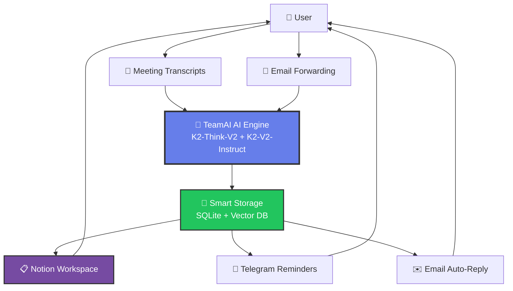
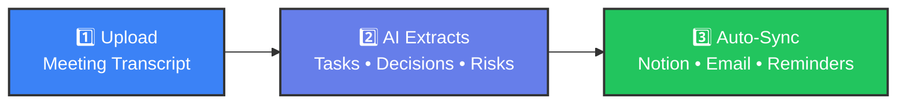
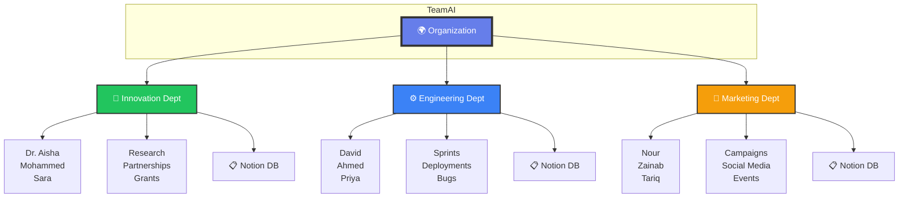
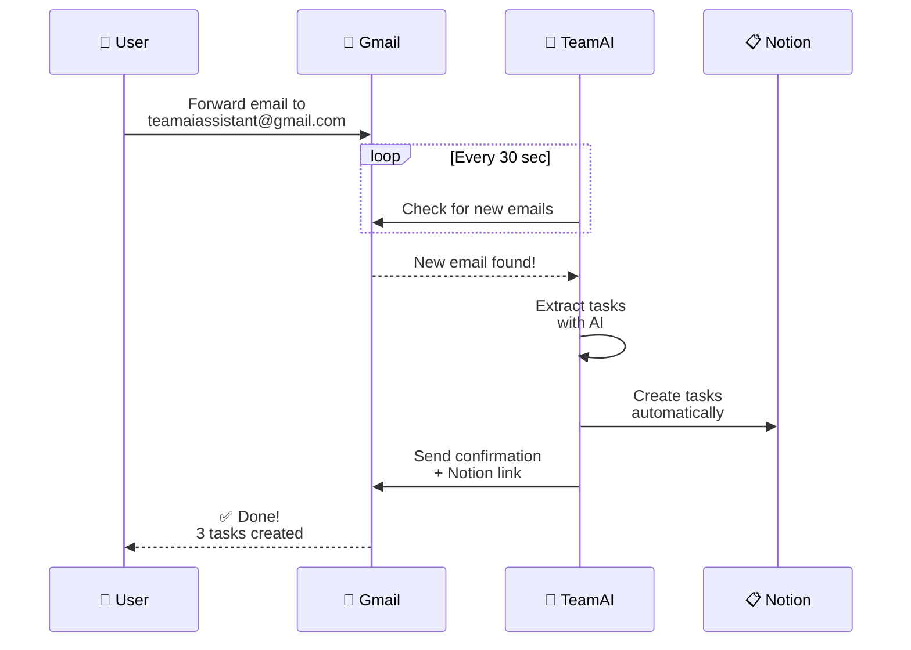
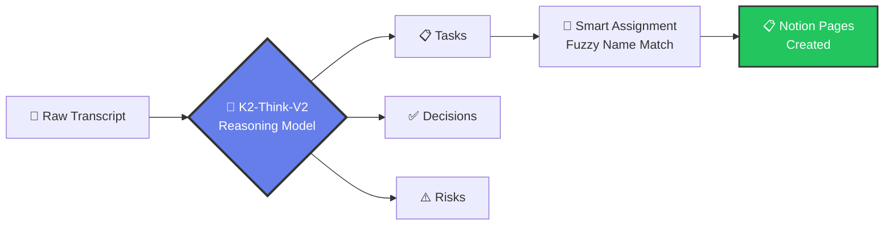
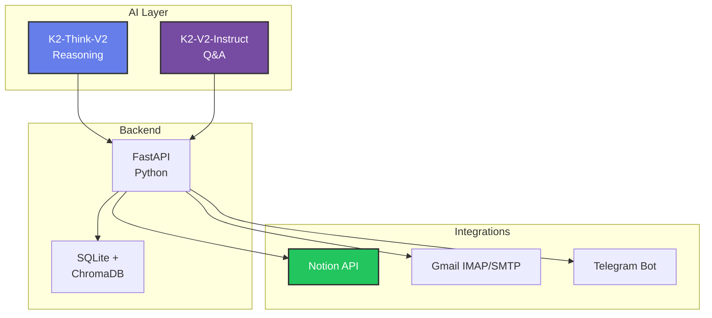
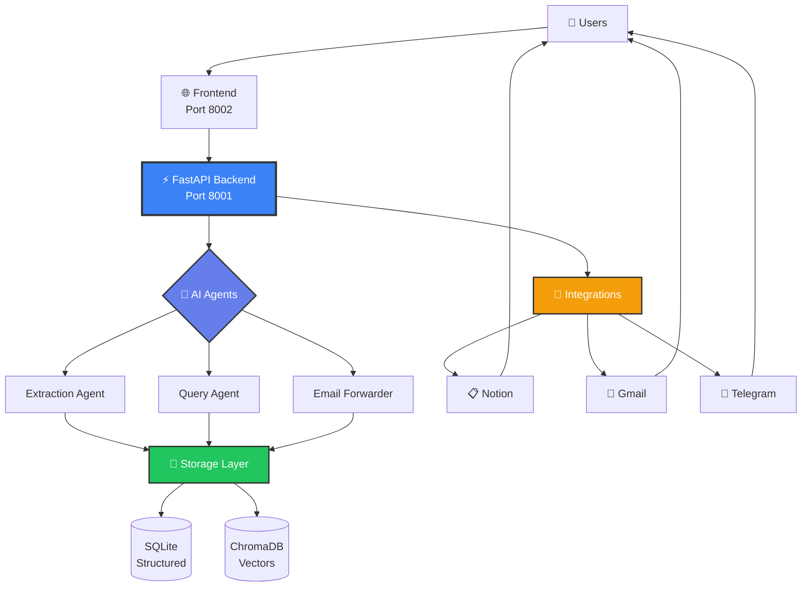

# TeamAI - Slide Diagrams

## 📊 Slide 1: System Overview (Simple)



**Caption:** "Upload meetings or forward emails → AI extracts tasks → Auto-syncs everywhere"

---

## 🎯 Slide 2: The Magic (3 Steps)



**Before TeamAI:** 2 hours of manual note-taking → tasks lost in Slack
**After TeamAI:** 20 seconds → tasks auto-created in Notion

---

## 🏢 Slide 3: Multi-Department Intelligence



**Key Feature:** Avani Gupta can be in both Innovation AND Marketing → No confusion!

---

## 📧 Slide 4: Email Forwarding Flow



**Impact:** Your email becomes a task creation machine

---

## 🧠 Slide 5: AI Processing Pipeline



**Example:**
- Input: "Avani needs to finish the report"
- AI Matches: "Avani Gupta" in Notion workspace
- Result: Task assigned to correct person ✅

---

## 💡 Slide 6: Key Features (Icon Grid)

```
┌──────────────────────────────────────────────────────────┐
│                                                          │
│  ⚡ 20-Second Extraction     📧 Email Assistant         │
│     AI processes meetings       Forward emails to get    │
│     in seconds, not hours       instant task creation    │
│                                                          │
│  🎯 Smart Assignment         🔔 Never Forget            │
│     Fuzzy name matching         Telegram reminders for   │
│     to Notion workspace         tasks due soon           │
│                                                          │
│  🏢 Multi-Department         🔍 Cross-Meeting Search    │
│     Same person in multiple     Ask AI about tasks       │
│     teams, zero confusion       across ALL meetings      │
│                                                          │
│  📋 Auto-Sync to Notion      🧠 Context-Aware           │
│     Tasks created without       Each department gets     │
│     manual copying              custom AI context        │
│                                                          │
└──────────────────────────────────────────────────────────┘
```

---

## 📈 Slide 7: Impact Metrics

```
┌─────────────────────────────────────────┐
│          BEFORE          →    AFTER     │
├─────────────────────────────────────────┤
│  2 hours manual notes    →  20 seconds  │
│  Tasks lost in Slack     →  100% tracked│
│  Forgotten decisions     →  Searchable  │
│  Manual Notion updates   →  Automated   │
│  Email overload          →  AI assistant│
└─────────────────────────────────────────┘
```

**ROI Example:**
- Team of 10 people
- 3 meetings per week
- Save 2 hours per meeting
- **= 60 hours saved per week = $4,800/week** (at $80/hr)

---

## 🎨 Slide 8: Tech Stack (Simple)



**Built in:** 2 weeks
**Production-ready:** Now

---

## 🚀 Slide 9: Architecture Summary (One Slide)



---

## 📊 Slide 10: Department Isolation (Visual)

```
┌─────────────────────────────────────────────────────────┐
│                  🌍 TeamAI Platform                     │
├─────────────────────────────────────────────────────────┤
│                                                         │
│  ┌──────────────┐  ┌──────────────┐  ┌─────────────┐  │
│  │ 🚀 Innovation│  │ ⚙️ Engineering│  │ 📣 Marketing│  │
│  ├──────────────┤  ├──────────────┤  ├─────────────┤  │
│  │ Team:        │  │ Team:        │  │ Team:       │  │
│  │ • Dr. Aisha  │  │ • David      │  │ • Nour      │  │
│  │ • Mohammed   │  │ • Ahmed      │  │ • Zainab    │  │
│  │ • Sara       │  │ • Priya      │  │ • Avani ✨  │  │
│  │ • Avani ✨   │  │              │  │             │  │
│  ├──────────────┤  ├──────────────┤  ├─────────────┤  │
│  │ Notion DB    │  │ Notion DB    │  │ Notion DB   │  │
│  │ Innovation   │  │ Engineering  │  │ Marketing   │  │
│  ├──────────────┤  ├──────────────┤  ├─────────────┤  │
│  │ Tasks: 12    │  │ Tasks: 8     │  │ Tasks: 15   │  │
│  │ Meetings: 5  │  │ Meetings: 3  │  │ Meetings: 7 │  │
│  └──────────────┘  └──────────────┘  └─────────────┘  │
│                                                         │
│  ✨ Avani Gupta appears in 2 departments               │
│  → Zero confusion, correct routing                     │
└─────────────────────────────────────────────────────────┘
```

---

## 🎬 Slide 11: Demo Flow (Visual Roadmap)

```
Step 1: UPLOAD                Step 2: EXTRACT              Step 3: SYNC
┌──────────────┐             ┌──────────────┐            ┌──────────────┐
│  📝 Paste    │             │  🤖 AI finds: │            │  ✅ Created: │
│  Meeting     │   ──────>   │  • 7 Tasks    │  ──────>   │  • Notion    │
│  Transcript  │             │  • 2 Decisions│            │  • Email     │
│              │             │  • 1 Risk     │            │  • Board     │
└──────────────┘             └──────────────┘            └──────────────┘
   20 seconds                   AI Processing                Automatic

Step 4: SEARCH               Step 5: REMIND               Step 6: INTELLIGENCE
┌──────────────┐             ┌──────────────┐            ┌──────────────┐
│  🔍 Ask AI:  │             │  📱 Telegram │            │  📊 Cross-   │
│  "Tasks for  │             │  3 days      │            │  Meeting     │
│  Avani?"     │             │  before due  │            │  Insights    │
└──────────────┘             └──────────────┘            └──────────────┘
   Instant answers              Never miss                  Patterns
```

---

## 💰 Slide 12: Value Proposition

```
┌───────────────────────────────────────────────────────┐
│                                                       │
│          THE PROBLEM                                  │
│   ═══════════════════════════════════════            │
│   • Meetings create tasks → lost in notes            │
│   • Manual Notion updates → time waste               │
│   • Decisions forgotten → repeated discussions       │
│   • Email overload → missed action items             │
│                                                       │
├───────────────────────────────────────────────────────┤
│                                                       │
│          THE SOLUTION: TeamAI                         │
│   ═══════════════════════════════════════            │
│   ✅ AI attends every meeting                        │
│   ✅ Extracts tasks automatically                    │
│   ✅ Syncs to Notion in real-time                    │
│   ✅ Sends reminders before deadlines                │
│   ✅ Answers questions about past meetings           │
│                                                       │
├───────────────────────────────────────────────────────┤
│                                                       │
│          THE RESULT                                   │
│   ═══════════════════════════════════════            │
│   📈 60 hours saved per week (10-person team)        │
│   🎯 100% task capture rate                          │
│   🧠 Searchable meeting memory                       │
│   💰 $4,800/week value (@ $80/hr)                    │
│                                                       │
└───────────────────────────────────────────────────────┘
```

---

## 🎯 Slide 13: Live Demo Checklist

```
✅ Pre-Demo (2 min before)
   □ Backend running on port 8001
   □ Frontend open: localhost:8002
   □ Notion tab open in background
   □ Sample transcript ready
   □ Email forwarder active

📋 Demo Steps (3 minutes)
   1. Upload Innovation Lab meeting
   2. Watch AI extract 7 tasks
   3. Show Notion auto-sync
   4. Switch to Marketing dept
   5. Show Avani in both depts
   6. Forward test email
   7. Show auto-reply
   8. Ask AI a question
   9. Show dashboard stats

🎬 Closing
   "Meeting intelligence, not just notes."
```

---

## 🔑 Slide 14: Key Differentiators

```
┌────────────────────────────────────────────────────┐
│                                                    │
│  TeamAI vs. Competitors                            │
│  ════════════════════════════                      │
│                                                    │
│  ❌ Fireflies.ai                                   │
│     • Generic transcription only                  │
│     • No department context                       │
│     • Manual Notion sync                          │
│                                                    │
│  ❌ Otter.ai                                       │
│     • Transcription focus                         │
│     • No task extraction                          │
│     • No team awareness                           │
│                                                    │
│  ❌ Notion AI                                      │
│     • Lives inside Notion only                    │
│     • No email integration                        │
│     • No autonomous processing                    │
│                                                    │
│  ✅ TeamAI                                         │
│     • Department-aware intelligence               │
│     • Auto-extracts tasks/decisions/risks         │
│     • Email forwarding assistant                  │
│     • Cross-meeting search                        │
│     • Auto-sync everywhere                        │
│     • Fuzzy name matching                         │
│                                                    │
└────────────────────────────────────────────────────┘
```

---

**All diagrams are Mermaid-compatible and can be:**
- Rendered in Markdown viewers
- Exported to PNG/SVG for slides
- Used in Notion pages
- Embedded in presentations

**To convert to images for PowerPoint/Keynote:**
1. Use https://mermaid.live
2. Paste diagram code
3. Export as PNG/SVG
4. Insert into slides
