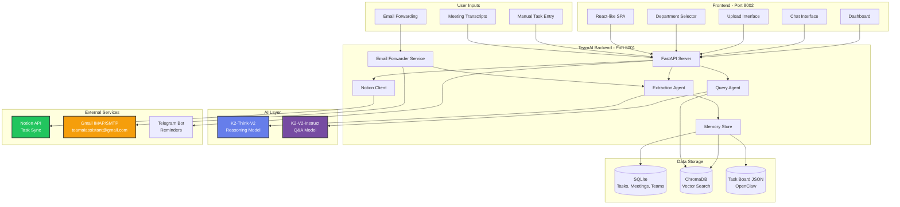
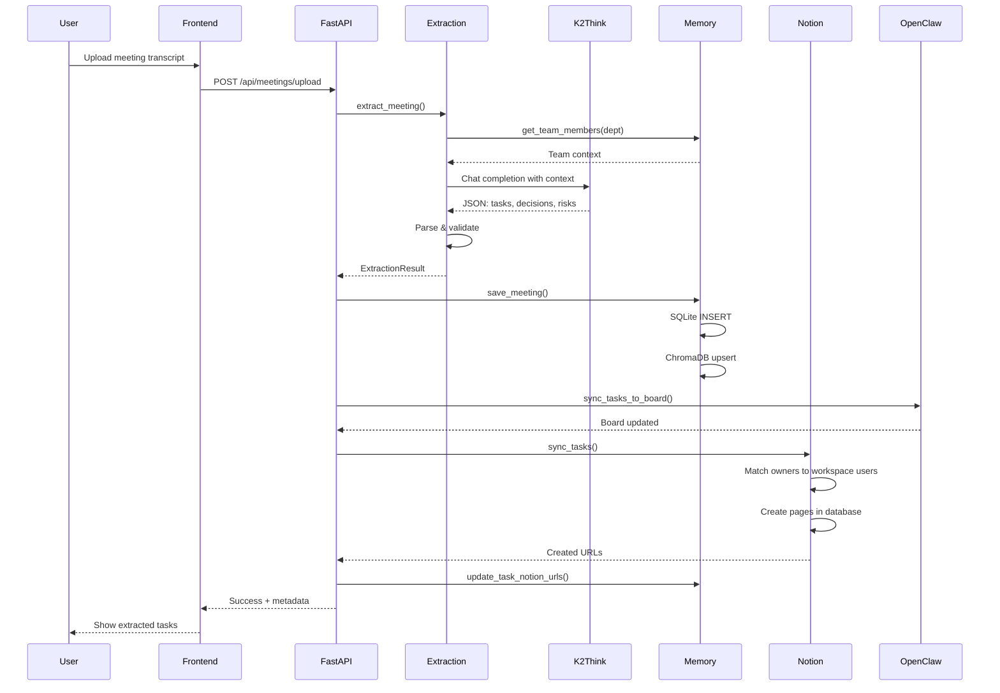
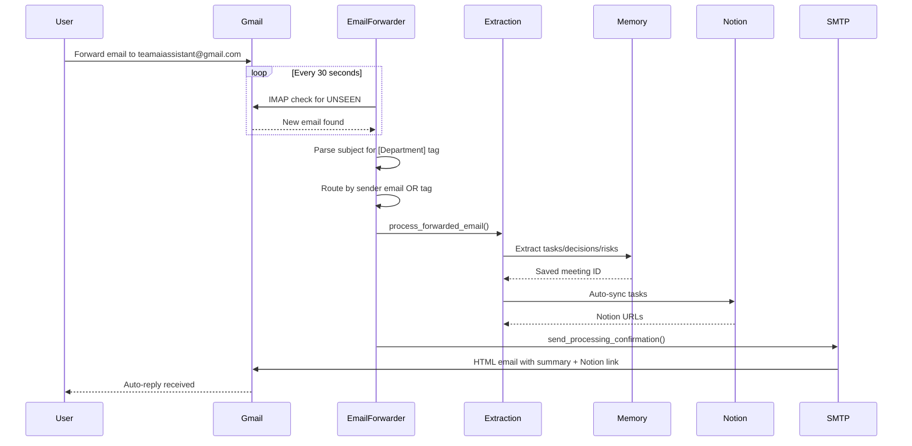
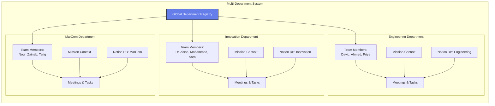
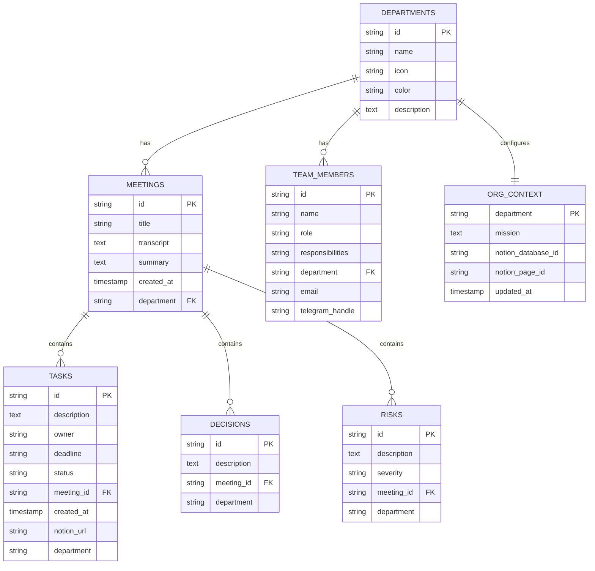

# TeamAI - System Architecture

## 🏗️ High-Level Architecture



---

## 🔄 Data Flow - Meeting Upload



---

## 📧 Email Forwarding Flow



---

## 🧠 Department-Aware Architecture



**Key Isolation:**
- Each department has separate team members
- Separate mission context for AI extraction
- Separate Notion databases
- Same person can exist in multiple departments (e.g., Avani in Innovation + MarCom)
- No cross-department task contamination

---

## 🗄️ Database Schema



---

## 🔌 API Endpoints

### **Meetings**
- `POST /api/meetings/upload` - Upload & extract meeting
- `GET /api/meetings` - List all meetings (filterable by department)
- `GET /api/meetings/{id}` - Get meeting details

### **Tasks**
- `GET /api/tasks` - List tasks (filter by status, department)
- `PUT /api/tasks/{id}/status` - Update task status
- `POST /api/tasks/sync-notion` - Manual Notion sync

### **Chat / Q&A**
- `POST /api/chat` - Ask department AI a question

### **Departments**
- `GET /api/departments` - List all departments
- `GET /api/state?department={dept}` - Get department dashboard state

### **Team Management**
- `GET /api/team?department={dept}` - List team members
- `POST /api/team` - Add team member
- `PUT /api/team/{id}` - Update team member
- `DELETE /api/team/{id}` - Remove team member

### **Org Context**
- `GET /api/org/context?department={dept}` - Get department mission
- `POST /api/org/context` - Save department mission

### **Notifications**
- `POST /api/notifications/due-reminders` - Send due task reminders

### **OpenClaw**
- `GET /api/openclaw/status` - Check OpenClaw gateway status
- `GET /api/board` - Get task board JSON

---

## 🧩 Component Breakdown

### **1. FastAPI Backend (`backend/main.py`)**
- Central API server
- Routes requests to agents
- Handles CORS, static file serving
- Manages startup/shutdown hooks

### **2. Extraction Agent (`backend/agents/extraction_agent.py`)**
- Uses K2-Think-V2 for reasoning
- Department-aware extraction
- Returns structured JSON: tasks, decisions, risks
- Cross-meeting insights detection

### **3. Memory Store (`backend/agents/memory_store.py`)**
- SQLite for structured data
- ChromaDB for semantic search
- Department filtering
- Task board JSON management

### **4. Notion Client (`backend/agents/notion_client.py`)**
- Workspace user matching (fuzzy name matching)
- Task page creation
- Multi-select property support (Status, Priority)
- Department-specific database routing

### **5. Email Forwarder (`backend/agents/email_forwarder.py`)**
- IMAP polling every 30 seconds
- Subject parsing for department tags
- Sender-to-department mapping
- Auto-reply with HTML email + Notion link

### **6. Query Agent (`backend/agents/query_agent.py`)**
- Uses K2-V2-Instruct for Q&A
- Searches ChromaDB + SQLite
- Department context injection
- Returns sources with answers

### **7. OpenClaw Client (`backend/agents/openclaw_client.py`)**
- Optional agentic workflow gateway
- Task board JSON management
- Meeting note markdown generation

### **8. Telegram Client (`backend/agents/telegram_client.py`)**
- Due task reminders
- Task assignment notifications
- Department-aware messaging

---

## 🎨 Frontend Architecture

```
Frontend (Single Page App)
│
├── Department Selector (Global State)
│   └── Updates all components on change
│
├── Navigation (Sidebar)
│   ├── Dashboard
│   ├── Upload Meeting/Email
│   ├── Ask AI
│   ├── Tasks
│   ├── Meetings History
│   ├── Team Setup
│   └── OpenClaw
│
├── Dashboard View
│   ├── Stats Cards (Meetings, Tasks, Decisions, Risks)
│   ├── Recent Tasks List
│   └── Open Risks List
│
├── Upload View
│   ├── Meeting/Email Toggle
│   ├── Department Selector
│   ├── Title Input
│   ├── Transcript Textarea
│   ├── Load Sample Button
│   ├── Auto-sync Notion Toggle
│   └── Results Display (Tasks, Decisions, Risks)
│
├── Chat View
│   ├── Department Context Header
│   ├── Suggested Questions Chips
│   ├── Chat History
│   ├── Input Field
│   └── Sources Display
│
├── Tasks View
│   ├── Department Board Grid
│   └── Notion Links
│
├── Meetings View
│   ├── Meeting Cards
│   └── Task/Decision/Risk Counts
│
└── Team Setup View
    ├── Team Members Table
    ├── Add Member Form
    ├── Edit Member Modal
    └── Org Context Form
```

---

## 🔐 Security & Configuration

### **Environment Variables (.env)**
```bash
# AI Models
K2_API_KEY=sk-xxx
OPENCLAW_BASE_URL=http://localhost:18789
OPENCLAW_TOKEN=teamai-local-token

# Notion
NOTION_API_KEY=ntn_xxx
NOTION_DATABASE_ID=30a4529e-75ee-80b0-8e33-e1d6c582a95c

# Email
SMTP_HOST=smtp.gmail.com
SMTP_PORT=587
SMTP_USER=teamaiassistant@gmail.com
SMTP_PASS=app_password_16_chars

TEAMAI_EMAIL=teamaiassistant@gmail.com
TEAMAI_EMAIL_PASSWORD=app_password_16_chars
IMAP_SERVER=imap.gmail.com
EMAIL_POLLING_INTERVAL=30

# Telegram (Optional)
TELEGRAM_BOT_TOKEN=xxx
TELEGRAM_CHAT_ID=xxx
```

### **Data Storage Locations**
```
/Users/avanigupta/teamAI/data/
├── teamai.db           # SQLite database
├── task_board.json     # OpenClaw task board
└── chroma/             # ChromaDB vector store
    ├── chroma.sqlite3
    └── [UUID]/         # Collection data
```

---

## 🚀 Deployment Options

### **Local Development**
```bash
# Backend
uvicorn backend.main:app --host 0.0.0.0 --port 8001 --reload

# Frontend (served by backend)
# Access at http://localhost:8001
```

### **Production Options**

**1. Single Server (Recommended for Demo)**
```bash
# Backend on 8001, frontend served statically
uvicorn backend.main:app --host 0.0.0.0 --port 8001
```

**2. ngrok (Temporary Public Access)**
```bash
ngrok http 8001
# Share the https://xxx.ngrok.io URL
```

**3. Cloud Deployment**
- **Railway**: One-click deploy, persistent storage
- **Render**: Free tier available, auto-deploy from git
- **Fly.io**: Edge deployment, global CDN

---

## 📊 Data Flow Summary

```
1. User Input
   ↓
2. FastAPI Endpoint
   ↓
3. Department Context Loading
   ↓
4. AI Processing (K2 Models)
   ↓
5. Data Persistence (SQLite + ChromaDB)
   ↓
6. External Sync (Notion + Email)
   ↓
7. Response to User
```

**Key Features:**
- ✅ Real-time extraction (20-30 seconds)
- ✅ Department isolation (no cross-contamination)
- ✅ Automatic Notion sync
- ✅ Email forwarding with auto-reply
- ✅ Cross-meeting search
- ✅ Task reminders (Telegram)
- ✅ Fuzzy name matching
- ✅ Multi-department user support

---

## 🎯 System Highlights

### **Innovation Points**
1. **Department-Aware AI**: Each department gets custom context for extraction
2. **Fuzzy Name Matching**: "Avani" correctly matches "Avani Gupta" in Notion
3. **Email Routing**: Subject tags `[Innovation]` or sender email mapping
4. **Cross-Meeting Intelligence**: K2-Think-V2 finds patterns across meetings
5. **Zero Manual Sync**: Tasks auto-create in Notion with correct assignees
6. **24/7 Email Assistant**: Forward emails, get instant task extraction

### **Tech Stack**
- **Backend**: FastAPI (Python 3.9+)
- **AI**: K2-Think-V2 (reasoning), K2-V2-Instruct (Q&A)
- **Database**: SQLite (structured), ChromaDB (vectors)
- **Integrations**: Notion API, Gmail IMAP/SMTP, Telegram Bot
- **Frontend**: Vanilla JS + CSS (no framework)
- **Deployment**: Uvicorn ASGI server

---

**Built for demo on:** 2026-02-19
**Architecture Version:** 1.0
